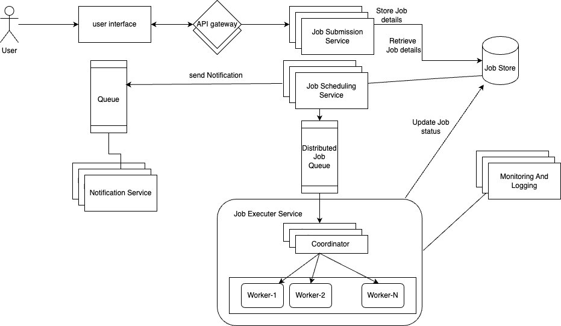
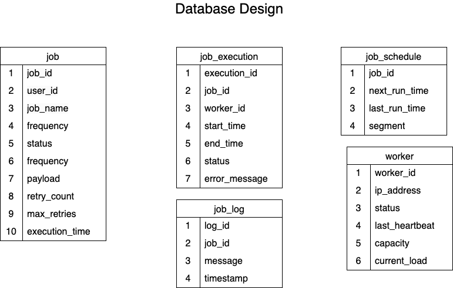

# Design a Distributed Job Scheduler

## _Fun. / Non-Fun. Requirements_
### Functional Requirements
1. **Job Submission:**
     * Users should be able to submit jobs to the scheduler.
     * Support for different job types (e.g., one-time, recurring).
     * Ability to specify job execution time and frequency.
2. **Job Management:**
     * Users can view, update, or cancel scheduled jobs.
     * Support for job prioritization.
     * Ability to pause and resume jobs.
3. **Job Execution:**
    * Execute jobs at the specified time.
    * Support for distributed execution across multiple nodes.
    * Ensure job execution reliability and consistency.
4. **Job Monitoring and Logging:**
    * Provide real-time status updates for jobs.
    * Log job execution details and history.
    * Alert users on job failures or delays.
5. **Scalability:**
    * Handle a large number of concurrent job submissions and executions.
    * Support for horizontal scaling to accommodate increased load.
6. **Security:**
    * Authenticate and authorize users for job submission and management.
    * Ensure data privacy and integrity during job execution.
7. **Fault Tolerance:**
    * Automatically retry failed jobs. 
    * Ensure system availability in case of node failures.
8. **API Access:**
   * Provide RESTful APIs for job submission, management, and monitoring.

### Non-Functional Requirements

1. **Performance:**
   * Low latency in job scheduling and execution.
   * Efficient resource utilization to minimize execution time.
2. **Reliability:**
   * High availability with minimal downtime.
   * Ensure job execution even in the event of partial system failures.
3. **Scalability:**
   * Ability to scale horizontally to support increasing job loads.
   * Efficient load balancing across distributed nodes.
4. **Consistency:**
   * Ensure data consistency across distributed components.
   * Provide eventual consistency for job status updates.
5. **Resilience:**
   * System should recover gracefully from failures.
   * Implement redundancy to prevent data loss.
6. **Security:**
   * Secure communication channels (e.g., HTTPS).
   * Implement role-based access control for job management.
7. **Observability:**
   * Provide comprehensive logging and monitoring.
   * Enable easy tracking of job execution metrics and system health.
8. **Extensibility:**
   * Design the system to accommodate future feature additions.
   * Support for plugin-based architecture for custom job types.

## _Traffic Estimation and Data Calculation_
#### Assumptions
1. **User Base:**
   * 10,000 active users.
   * Each user submits an average of 5 jobs per day.
2. **Job Characteristics:**
   * Average job size: 1 KB metadata. 
   * Average job execution time: 5 minutes. 
   * 10% of jobs are recurring.
3. **System Load:**
   * Peak load occurs during business hours (9 AM - 5 PM). 
   * 70% of jobs are submitted during peak hours.
4. **Data Retention:**
   * Job logs retained for 30 days. 
   * Job metadata retained indefinitely.
#### Write Flow
1. Job Submission:
   * 50,000 job submissions per day. 
   * 35,000 submissions during peak hours. 
   * 15,000 submissions during off-peak hours.
2. Job Updates:
   * 20% of jobs are updated at least once. 
   * 10,000 job updates per day.
3. Job Execution Logs:
   * Each job generates 5 KB of logs. 
   * 250,000 KB (250 MB) of logs generated per day.
#### Read Flow
1. Job Status Checks:
   * Users check job status twice per job on average. 
   * 100,000 status checks per day.
2. Job History Retrieval:
   * 10% of users retrieve job history daily.
   * 1,000 job history retrievals per day.
3. Monitoring and Alerts:
   * System generates alerts for 1% of jobs.
   * 500 alerts per day.
#### Data Storage
1. Job Metadata:
   * 50,000 jobs x 1 KB = 50,000 KB (50 MB) per day.
   * 50 MB * 30 Day = 1.5 GB per month.
2. Job Logs:
   * 250 MB of logs per day.
   * 250 MB * 30 Day = 7.5 GB of logs per month.

**Total Storage Requirement:**
   * 1.5 GB (metadata) + 7.5 GB (logs) = 9 GB per month.
   * 9 GB * 12 Months = 108 GB per year.
3. **Database Growth:**
   * Assuming a 10% annual increase in user base and job submissions.
   * Plan for 120 GB storage capacity for the first year, with scalability options for future growth.

## _API Design_

1. **Submit Job**
    * Endpoint: POST /api/jobs
    * Request:
      ```json
      {
         "jobName": "string",
         "jobType": "one-time | recurring",
         "executionTime": "ISO 8601 timestamp",
         "frequency": "string (e.g., daily, weekly)",
         "priority": "low | medium | high",
         "payload": "object"
      }
      ```
    * Response:
      ```json
      {
         "jobId": "string",
         "status": "submitted"
      }
      ```

2. **Update Job**
    * Endpoint: PUT /api/jobs/{jobId}
    * Request:
      ```json
      {
         "jobName": "string",
         "executionTime": "ISO 8601 timestamp",
         "frequency": "string",
         "priority": "low | medium | high",
         "payload": "object"
      }
      ```
    * Response:
      ```json
      {
         "jobId": "string",
         "status": "updated"
      }
      ```
3. **Cancel Job**
    * Endpoint: DELETE /api/jobs/{jobId}
    * Request: None
    * Response:
      ```json
      {
         "jobId": "string",
         "status": "cancelled"
      }
      ```
4. **Get Job Status**
    * Endpoint: GET /api/jobs/{jobId}/status
    * Request: None
    * Response:
      ```json
      {
         "jobId": "string",
         "status": "pending | running | completed | failed",
         "lastUpdated": "ISO 8601 timestamp"
      }
      ```
5. **List Jobs**
    * Endpoint: GET /api/jobs
    * Request:
      * Query Parameters: status, type, priority, page, limit
    * Response:
      ```json
      [
         {
            "jobId": "string",
            "jobName": "string",
            "status": "string",
            "executionTime": "ISO 8601 timestamp"
         },
         ...
      ]
      ```

6. **Get Job Logs**
    * Endpoint: GET /api/jobs/{jobId}/logs
    * Request: None
    * Response:
      ```json
      {
         "jobId": "string",
         "logs": [
            {
               "timestamp": "ISO 8601 timestamp",
               "message": "string"
            },
            ...
         ]
      }
      ```
7. **Pause Job**
    * Endpoint: POST /api/jobs/{jobId}/pause
    * Request: None
    * Response:
      ```json
      {
         "jobId": "string",
         "status": "paused"
      }
      ```
8. **Resume Job**
    * Endpoint: POST /api/jobs/{jobId}/resume
    * Request: None
    * Response:
      ```json
      {
         "jobId": "string",
         "status": "resumed"
      }
      ```
      
## _High-Level Architecture_
### Key Components

1. **API Gateway:**
   * Acts as the entry point for all client requests. 
   * Routes requests to appropriate services. 
   * Handles authentication and rate limiting.
2. **Job Submission Service:**
   * Core component responsible for scheduling and managing jobs. 
   * Interfaces with the database to store and retrieve job details. 
   * Communicates with the Job Executor Service to trigger job execution.
3. **Job Scheduling service**
   * The Scheduling Service is responsible for selecting jobs for execution based on their next_run_time in the Job Schedules Table
   * It periodically queries the table for jobs scheduled to run at the current minute:
        ```SQl 
          SELECT * FROM JobSchedulesTable WHERE next_run_time = 1726110000;
        ```
      Once the due jobs are retrieved, they are pushed to the Distributed Job Queue for worker nodes to execute.
      Simultaneously, the status in Job Table is updated to SCHEDULED.
4. **Distributed Job Queue**
   * The Distributed Job Queue (e.g., Kafka, RabbitMQ) acts as a buffer between the Scheduling Service and the Execution Service, ensuring that jobs are distributed efficiently to available worker nodes. 
   * It holds the jobs and allows the execution service to pull jobs and assign it to worker nodes.
5. **Job Executor Service:**
   * Executes jobs as per the schedule.
     The Execution Service is responsible for running the jobs on worker nodes and updating the results in the Job Store.
      It consists of a coordinator and a pool of worker nodes.
     #### Coordinator: A coordinator (or orchestrator) node takes responsibility for:
        * **Assigning jobs:** Distributes jobs from the queue to the available worker nodes. 
        * **Managing worker nodes:** Tracks the status, health, capacity, and workload of active workers. 
        * **Handling worker node failures:** Detects when a worker node fails and reassigns its jobs to other healthy nodes. 
        * **Load balancing:** Ensures the workload is evenly distributed across worker nodes based on available resources and capacity.
     #### Worker Nodes: Worker nodes are responsible for executing jobs and updating the Job Store with the results (e.g., completed, failed, output).
        * When a worker is assigned a job, it creates a new entry in the Job Execution Table with the job’s status set to running and begins execution. 
        * After execution is finished, the worker updates the job’s final status (e.g., completed or failed) along with any output in both the Jobs and Job Execution Table. 
        * If a worker fails during execution, the coordinator re-queues the job in the distributed job queue, allowing another worker to pick it up and complete it.
4. **Database:**
   * Stores job metadata, user information, and execution logs.
   * Relational database to ensure data consistency and support complex queries.
5. **Monitoring and Logging System:**
   * Collects and aggregates logs from various services. 
   * Provides real-time monitoring and alerting for system health and job execution.
6. **Notification Service:**
   * Sends alerts and notifications to users about job status changes or failures.
   * Integrates with email, SMS, or other messaging platforms.

### _End-to-End Request Flow_
1. **Job Submission:**
   * A user submits a job request via the API Gateway. 
   * The API Gateway authenticates the request and forwards it to the Job Scheduler Service. 
   * The Job Scheduler Service validates the request, stores job details in the database, and schedules the job for execution. 
2. **Job Execution:**
   * At the scheduled time, the Job Scheduler Service triggers the Job Executor Service.
   * The Job Executor Service retrieves job details from the database and executes the job.
   * Upon completion, the Job Executor Service updates the job status and logs in the database.
3. **Job Monitoring:**
   * Users can query job status via the API Gateway. 
   * The Job Scheduler Service retrieves the current status from the database and returns it to the user. 
   * The Monitoring and Logging System continuously tracks job execution and system performance, sending alerts if anomalies are detected.
4. **Notifications:**
   * The Notification Service sends updates to users about job completion or failure.
   * Users receive notifications through their preferred communication channels.

### high level design


### Database Design

1. **Job Table:**
   * This table stores the metadata of the job, including job id, user id, frequency, payload, execution time, retry count and status (pending, running, completed, failed).
2. **Job Execution Table**
   * Jobs can be executed multiple times in case of failures. 
     This table tracks the execution attempts for each job, storing information like execution id, start time, end time, worker id, status and error message.
     If a job fails and is retried, each attempt will be logged here.
3. **Job Schedules Table**
   * The Schedules Table stores scheduling details for each job, including the next_run_time. 
   * For one-time jobs, the next_run_time is the same as the job’s execution time, and the last_run_time remains null.
   * For recurring jobs, the next_run_time is updated after each execution to reflect the next scheduled run.
4. **Worker Table**
   * The Worker Node Table stores information about each worker node, including its ip address, status, last heartbeat, capacity and current load.
5. **Job Logs Table**
   * This table stores logs generated during job execution, including the job id, execution id, timestamp, message, and log level.

### _Deep Dive into Key Components_
1. **SQL vs NoSQL**
   * To choose the right database for our needs, let's consider some factors that can affect our choice:
      * We need to store millions of jobs every day. 
      * Read and Write queries are around the same. 
      * Data is structured with fixed schema. 
      * We don’t require ACID transactions or complex joins.
   * Both SQL and NoSQL databases could meet these needs, but given the scale and nature of the workload, a NoSQL database like DynamoDB or Cassandra could be a better fit, especially when handling millions of jobs per day and supporting high-throughput writes and reads.
2. **Scaling Scheduling Service**
   * The Scheduling service periodically checks the Job Schedules Table every minute for pending jobs and pushes them to the job queue for execution. 
      * For example, the following query retrieves all jobs due for execution at the current minute:
       ```SQL
      SELECT * FROM JobSchedulesTable WHERE next_run_time = 1726110000;
       ```
   * Optimizing reads from JobSchedulesTable:
      * Since we are querying JobSchedulesTable using the next_run_time column, it’s a good idea to partition the table on the next_run_time column to efficiently retrieve all jobs that are scheduled to run at a specific minute.
      * If the number of jobs in any minute is small, a single node is enough.
        However, during peak periods, such as when 50,000 jobs need to be processed in a single minute, relying on one node can lead to delays in execution.
        The node may become overloaded and slow down, creating performance bottlenecks.
        Additionally, having only one node introduces a single point of failure.
        If that node becomes unavailable due to a crash or other issue, no jobs will be scheduled or executed until the node is restored, leading to system downtime.
      * To address this, we need a distributed architecture where multiple worker nodes handle job scheduling tasks in parallel, all coordinated by a central node.

   * **But how can we ensure that jobs are not processed by multiple workers at the same time?**
     * The solution is to divide jobs into segments. Each worker processes only a specific subset of jobs from the JobSchedulesTable by focusing on assigned segments.
     * This is achieved by adding an extra column called segment.
       The segment column logically groups jobs (e.g., segment=1, segment=2, etc.), ensuring that no two workers handle the same job simultaneously.
     * A coordinator node manages the distribution of workload by assigning different segments to worker nodes.
       It also monitors the health of the workers using heartbeats or health checks.
     * In cases of worker node failure, the addition of new workers, or spikes in traffic, the coordinator dynamically rebalances the workload by adjusting segment assignments.
     * Each worker node queries the JobSchedulesTable using both next_run_time and its assigned segments to retrieve the jobs it is responsible for processing.
       Here's an example of a query a worker node might execute:
       ```SQL
        SELECT * FROM JobSchedulesTable WHERE next_run_time = 1726110000 AND segment in (1,2);
       ```
3. **Handling failure of Jobs**
   * When a job fails during execution, the worker node increments the retry_count in the JobTable.
     If the retry_count is still below the max_retries threshold, the worker retries the job from the beginning.
   * Once the retry_count reaches the max_retries limit, the job is marked as failed and will not be executed again, with its status updated to failed.
   ##### Note: After a job fails, the worker node should not immediately retry the job, especially if the failure was caused by a transient issue (e.g., network failure). Instead, the system retries the job after a delay, which increases exponentially with each subsequent retry (e.g., 1 minute, 5 minutes, 10 minutes).
4. **Handling failure of Worker nodes in Execution Service**
   * Worker nodes are responsible for executing jobs assigned to them by the coordinator in the Execution Service.
     When a worker node fails, the system must detect the failure, reassign the pending jobs to healthy nodes, and ensure that jobs are not lost or duplicated.
     There are several techniques for detecting failures:
      * **Heartbeat Mechanism:** Each worker node periodically sends a heartbeat signal to the coordinator (every few seconds). The coordinator tracks these heartbeats and marks a worker as "unhealthy" if it doesn’t receive a heartbeat for a predefined period (e.g., 3 consecutive heartbeats missed).
      * **Health Checks:** In addition to heartbeats, the coordinator can perform periodic health checks on each worker node. The health checks may include CPU, memory, disk space, and network connectivity to ensure the node is not overloaded. Once a worker failure is detected, the system needs to recover and ensure that jobs assigned to the failed worker are still executed.
   * There are two main scenarios to handle:
      * **Pending Jobs (Not Started):** For jobs that were assigned to a worker but not yet started, the system needs to reassign these jobs to another healthy worker.
        The coordinator should re-queue them to the job queue for another worker to pick up.
      * **In-Progress Jobs:** Jobs that were being executed when the worker failed need to be handled carefully to prevent partial execution or data loss.
   * One technique is to use job checkpointing, where a worker periodically saves the progress of long-running jobs to a persistent store (like a database). If the worker fails, another worker can restart the job from the last checkpoint.
     If a job was partially executed but not completed, the coordinator should mark the job as "failed" and re-queue it to the job queue for retry by another worker.
5. **Addressing Single Points of Failure**
   * We are using a coordinator node in both the Scheduling and Execution service.
    To prevent the coordinator from becoming a single point of failure, deploy multiple coordinator nodes with a leader-election mechanism.
    This ensures that one node is the active leader, while others are on standby. If the leader fails, a new leader is elected, and the system continues to function without disruption.
      * **Leader Election:** Use a consensus algorithm like Raft or Paxos to elect a leader from the pool of coordinators. Tools like Zookeeper or etcd are commonly used for managing distributed leader elections.
      * **Failover:** If the leader coordinator fails, the other coordinators detect the failure and elect a new leader. The new leader takes over responsibilities immediately, ensuring continuity in job scheduling, worker management, and health monitoring.
      * **Data Synchronization:** All coordinators should have access to the same shared state (e.g., job scheduling data and worker health information). This can be stored in a distributed database (e.g., Cassandra, DynamoDB). This ensures that when a new leader takes over, it has the latest data to work with.
