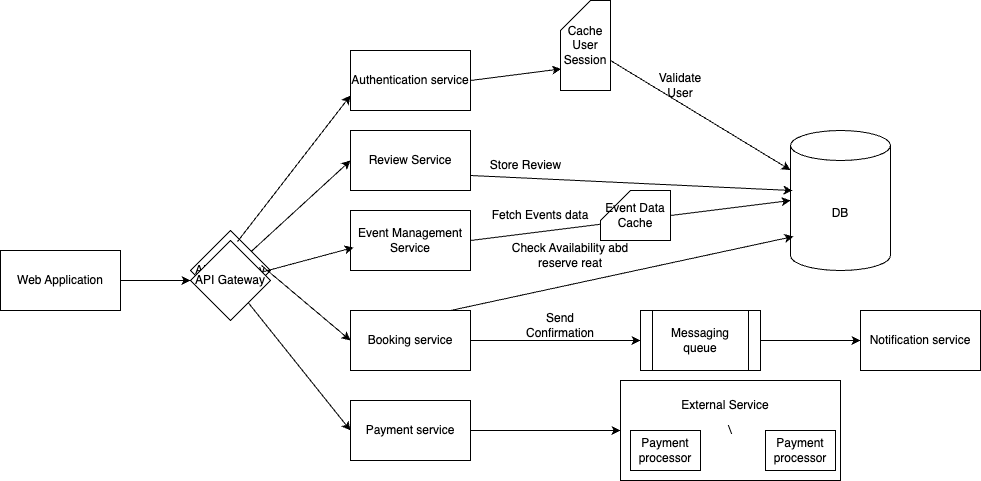

# Design an Online Ticket Booking System

## _Fun. / Non-Fun. Requirements_
### Functional Requirements
1. **User Registration and Authentication:**
     * Users should be able to create an account using email or social media.
     * Secure login and logout functionality.
     * Ability to specify job execution time and frequency.
2. **Search and Browse Events:**
     * Users can search for events by location, date, category or keyword.
     * Display event details including date, time, venue and available seats.
3. **Ticket Booking:**
    * Users can select the number of tickets and choose seating preference if applicable.
    * provide a summary of the booking before confirmation.
4. **Payment Processing:**
    * Integration with multiple payment gateways(credit card, PayPal).
    * Secure transaction processing and confirmation
5. **Cancellation and Refunds:**
    * Allow users to cancel bookings with a specified time frame.
    * process refunds according to the events cancellation policy.
6. **Admin panel:**
    * Admin can add, update or remove events.
    * View booking statistics and manage user queries.
7. **User review and Ratings:**
    * Users can leave reviews and ratings for events they attended. 
8. **Loyalty and discounts:**
   * Implement a loyalty program for frequent users.
   * Offer discounts and promotional codes for events.

### Non-Functional Requirements

1. **Performance:**
   * Fast response times for searches and bookings.
   * Efficient load balancing to manage traffic spikes.
2. **Reliability:**
   * High availability with minimal downtime.
   * Implement data redundancy and backups strategies.
3. **Scalability:**
   * the system should handle large number of concurrent users, especially during pick times.
4. **Consistency:**
   * Ensure accurate and up-to-date information on event availability and bookings
   * Provide eventual consistency for job status updates.
5. **Resilience:**
   * System should recover gracefully from failures.
   * Implement redundancy to prevent data loss.
6. **Security:**
   * Protect user data with encryption and secure authentication.
   * Ensure compliance with data protection regulations.
7**Extensibility:**
   * Design the system to accommodate future feature additions.

## _Traffic Estimation and Data Calculation_
#### Assumptions
1. **User Base:** 
   * 1 million registered users.
   * 10% active users daily.
   * Each user submits an average of 5 jobs per day.
2. **Event Listings:**
   * 10,000 events listed at any given time. 
   * Average 100 seats per events. 
3. **Traffic pattern:**
   * Peak traffic during weekends and holidays. 
   * 5% of daily active users book tickets during peak times.
4. **Data Retention:**
   * Store booking history for 1 year. 
   * Store user data indefinitely unless user account deleted.
#### Write Flow
1. User Registration:
   * 5,000 new registration per day. 
   * 2,500 bookings per hour during peak times. 
   * 15,000 submissions during off-peak hours.
2. Event Updates:
   * 1,000 event update per day by admins. 
3. Review and ratings:
   * 20,000 reviews submitted per day. 
#### Read Flow
1. event searches:
   * 500,000 searches per day. 
   * 25,000 searches per hour during peek times.
2. Booking Confirmations:
   * 50,000 confirmation views per day.
3. User Profile views:
   * 100,000 profile views per day.
4. Event details view: 
   * 1,000,000 event details view per day.
#### Data Storage
1. User Data:
   * Average of 1KB per user.
   * Total : 1 million * 1KB = 1 GB. 
2. Event Data:
   * Average of 5KB per event.
   * total: 10000 * 5KB = 50MB.
3. Booking Data:
   * Average of 2KB per booking.
   * Total: 50000 daily * 30 days * 12 months * 2KB -> 36 * 10^9 = 36GB.
4. Review data:
   * Average of 1KB per review.
   * Total: 20000 daily * 30 days * 12 months * 1KB -> 7.2 * 10^6 = 7.2GB.
**Total Storage Requirement:**
   * 36GB + 7.2 GB + 1 GB + 50 MB ~ 45GB per year.

## _API Design_

1. **User Registration and Authentication**
    * Endpoint: POST /api/register
    * Request:
      ```json
      {
         "email": "string",
         "password": "String",
         "name": "String"
      }
      ```
    * Response:
      ```json
      {
         "userId": "string",
         "message": "user registered successfully"
      }
      ```
    * Endpoint: POST /api/login
    * Request:
      ```json
      {
         "email": "string",
         "password": "String"
      }
      ```
    * Response:
      ```json
      {
         "token": "string",
         "message": "login successful"
      }
      ```

2. **Search and Browse Events**
    * Endpoint: GET /api/events
    * Request: **?location=string&date=string&category=string&keyword=string**
    * Response:
      ```json
      [{
         "eventId": "string",
         "name": "string",
         "date": "string",
         "location": "string",
         "availableSeats": "number"
      }]
      ```
    * Endpoint: GET /api/events/{eventId}
    * Request: None
    * Response:
      ```json
      {
         "eventId": "string",
         "name": "string",
         "date": "string",
         "location": "string",
         "availableSeats": "number"
      }
      ```
3. **Ticket Booking**
    * Endpoint: POST /api/bookings
    * Request: 
      ```json
      {
         "eventId": "string",
         "userId": "string",
         "numberOfTickets": "number",
         "seatPreferences": "string"
      }
      ```
    * Response:
      ```json
      {
         "bookingId": "string",
         "message": "booking successful",
         "total price": "number"
      }
      ```
4. **Payment Processing**
    * Endpoint: POST /api/payments
    * Request:
      ```json
      {
         "bookingId": "string",
         "paymentMethod": "string",
         "amount": "number"
      }
      ```
    * Response:
      ```json
         {
            "paymentId": "string",
            "status": "string",
            "message": "payment processed successfully"
         }
      ```
5. **Booking Confirmation and Notifications**
    * Endpoint: GET /api/bookings/{bookingId}
    * Request: None
    * Response:
      ```json
      {
         "bookingId": "string",
         "eventDetails": "string",
         "qrCode": "string"
      }
      ```
6. **Cancellation and Refunds**
    * Endpoint: DELETE /api/bookings/{bookingId}
    * Request: None
    * Response:
      ```json
      {
         "message": "booking cancelled successfully",
         "refund amount": "number"
      }
      ```
7. **Admin panel**
    * Endpoint: POST /api/admin/events
    * Request: 
      ```json
      { 
      "name": "string", 
      "date": "string", 
      "location": "string", 
      "details": "string", 
      "totalSeats": "number" 
      }
      ```
    * Response:
      ```json
      {
         "eventId": "string",
         "message": "event created successfully"
      }
      ```
   
   * Endpoint: PUT /api/admin/events/{eventId}
   * Request:
   ```json
   { 
   "name": "string", 
   "date": "string", 
   "location": "string", 
   "details": "string", 
   "totalSeats": "number" 
   }
   ```
   * Response:
   ```json
   {
      "eventId": "string",
      "message": "event updated successfully"
   }
   ```
8. **User Review and Ratings**
    * Endpoint: POST /api/reviews
    * Request:
      ```json
      { 
      "eventId": "string", 
      "userId": "string", 
      "rating": "string", 
      "review": "string" 
      }
      ```
    * Response:
      ```json
      {
         "reviewId": "string",
         "message": "review submitted successfully"
      }
      ```   
9. **Loyalty and Discount**
    * Endpoint: GET /api/loyalty/{userId}
    * Request: None
    * Response:
      ```json
      {
         "userId": "string",
         "loyaltyPoints": "number",
         "availableDiscount": "array"
      }
      ```   
      
## _High-Level Architecture_
### Key Components

1. **Authentication Service:**
   * **User Management**: Handles user registration, profile update, and password management.
   * **Token Service** : Generates and validates JWT tokens for secure user sessions.
   * **Scalability**: Stateless JWT token allow for easy scaling across multiple servers without session persistence. 
   * Implement rate limiting to prevent brute force attacks
2. **Booking Service:**
   * **Availability Checker**: Verifies seat availability before booking. 
   * **Reservation Manager**: Temporarily holds seats during the booking process.
   * **Booking processor**: Finalise booking and update the seat availability.
   * Implement optimistic locking to handle concurrent booking requests. 
   * Use a distributed lock manager (e.g., Redis) to manage seat reservations.
3. **Payment service**
   * **Payment Gateway Integration**: interfaces with third-party payment providers.
   * Transaction logger : Records all payments transactions for auditing and reconciliation.
4. **Notification service**
   * Use a message queue to manage notification requests and ensure delivery. 
5. **Event Management Service:**
   * **Event Catalog**: Stores and retrieves event details.
   * Search Engine: Provides fast and efficient search capabilities.
   * Use full-text search capabilities for event search.

### _End-to-End Request Flow_
1. **Job Submission:**
   * A user submits a job request via the API Gateway. 
   * The API Gateway authenticates the request and forwards it to the Job Scheduler Service. 
   * The Job Scheduler Service validates the request, stores job details in the database, and schedules the job for execution. 
2. **Job Execution:**
   * At the scheduled time, the Job Scheduler Service triggers the Job Executor Service.
   * The Job Executor Service retrieves job details from the database and executes the job.
   * Upon completion, the Job Executor Service updates the job status and logs in the database.
3. **Job Monitoring:**
   * Users can query job status via the API Gateway. 
   * The Job Scheduler Service retrieves the current status from the database and returns it to the user. 
   * The Monitoring and Logging System continuously tracks job execution and system performance, sending alerts if anomalies are detected.
4. **Notifications:**
   * The Notification Service sends updates to users about job completion or failure.
   * Users receive notifications through their preferred communication channels.

### high level design


### Database Design

1. **Job Table:**
   * This table stores the metadata of the job, including job id, user id, frequency, payload, execution time, retry count and status (pending, running, completed, failed).
2. **Job Execution Table**
   * Jobs can be executed multiple times in case of failures. 
     This table tracks the execution attempts for each job, storing information like execution id, start time, end time, worker id, status and error message.
     If a job fails and is retried, each attempt will be logged here.
3. **Job Schedules Table**
   * The Schedules Table stores scheduling details for each job, including the next_run_time. 
   * For one-time jobs, the next_run_time is the same as the job’s execution time, and the last_run_time remains null.
   * For recurring jobs, the next_run_time is updated after each execution to reflect the next scheduled run.
4. **Worker Table**
   * The Worker Node Table stores information about each worker node, including its ip address, status, last heartbeat, capacity and current load.
5. **Job Logs Table**
   * This table stores logs generated during job execution, including the job id, execution id, timestamp, message, and log level.

### _Deep Dive into Key Components_
1. **SQL vs NoSQL**
   * To choose the right database for our needs, let's consider some factors that can affect our choice:
      * We need to store millions of jobs every day. 
      * Read and Write queries are around the same. 
      * Data is structured with fixed schema. 
      * We don’t require ACID transactions or complex joins.
   * Both SQL and NoSQL databases could meet these needs, but given the scale and nature of the workload, a NoSQL database like DynamoDB or Cassandra could be a better fit, especially when handling millions of jobs per day and supporting high-throughput writes and reads.
2. **Scaling Scheduling Service**
   * The Scheduling service periodically checks the Job Schedules Table every minute for pending jobs and pushes them to the job queue for execution. 
      * For example, the following query retrieves all jobs due for execution at the current minute:
       ```SQL
      SELECT * FROM JobSchedulesTable WHERE next_run_time = 1726110000;
       ```
   * Optimizing reads from JobSchedulesTable:
      * Since we are querying JobSchedulesTable using the next_run_time column, it’s a good idea to partition the table on the next_run_time column to efficiently retrieve all jobs that are scheduled to run at a specific minute.
      * If the number of jobs in any minute is small, a single node is enough.
        However, during peak periods, such as when 50,000 jobs need to be processed in a single minute, relying on one node can lead to delays in execution.
        The node may become overloaded and slow down, creating performance bottlenecks.
        Additionally, having only one node introduces a single point of failure.
        If that node becomes unavailable due to a crash or other issue, no jobs will be scheduled or executed until the node is restored, leading to system downtime.
      * To address this, we need a distributed architecture where multiple worker nodes handle job scheduling tasks in parallel, all coordinated by a central node.

   * **But how can we ensure that jobs are not processed by multiple workers at the same time?**
     * The solution is to divide jobs into segments. Each worker processes only a specific subset of jobs from the JobSchedulesTable by focusing on assigned segments.
     * This is achieved by adding an extra column called segment.
       The segment column logically groups jobs (e.g., segment=1, segment=2, etc.), ensuring that no two workers handle the same job simultaneously.
     * A coordinator node manages the distribution of workload by assigning different segments to worker nodes.
       It also monitors the health of the workers using heartbeats or health checks.
     * In cases of worker node failure, the addition of new workers, or spikes in traffic, the coordinator dynamically rebalances the workload by adjusting segment assignments.
     * Each worker node queries the JobSchedulesTable using both next_run_time and its assigned segments to retrieve the jobs it is responsible for processing.
       Here's an example of a query a worker node might execute:
       ```SQL
        SELECT * FROM JobSchedulesTable WHERE next_run_time = 1726110000 AND segment in (1,2);
       ```
3. **Handling failure of Jobs**
   * When a job fails during execution, the worker node increments the retry_count in the JobTable.
     If the retry_count is still below the max_retries threshold, the worker retries the job from the beginning.
   * Once the retry_count reaches the max_retries limit, the job is marked as failed and will not be executed again, with its status updated to failed.
   ##### Note: After a job fails, the worker node should not immediately retry the job, especially if the failure was caused by a transient issue (e.g., network failure). Instead, the system retries the job after a delay, which increases exponentially with each subsequent retry (e.g., 1 minute, 5 minutes, 10 minutes).
4. **Handling failure of Worker nodes in Execution Service**
   * Worker nodes are responsible for executing jobs assigned to them by the coordinator in the Execution Service.
     When a worker node fails, the system must detect the failure, reassign the pending jobs to healthy nodes, and ensure that jobs are not lost or duplicated.
     There are several techniques for detecting failures:
      * **Heartbeat Mechanism:** Each worker node periodically sends a heartbeat signal to the coordinator (every few seconds). The coordinator tracks these heartbeats and marks a worker as "unhealthy" if it doesn’t receive a heartbeat for a predefined period (e.g., 3 consecutive heartbeats missed).
      * **Health Checks:** In addition to heartbeats, the coordinator can perform periodic health checks on each worker node. The health checks may include CPU, memory, disk space, and network connectivity to ensure the node is not overloaded. Once a worker failure is detected, the system needs to recover and ensure that jobs assigned to the failed worker are still executed.
   * There are two main scenarios to handle:
      * **Pending Jobs (Not Started):** For jobs that were assigned to a worker but not yet started, the system needs to reassign these jobs to another healthy worker.
        The coordinator should re-queue them to the job queue for another worker to pick up.
      * **In-Progress Jobs:** Jobs that were being executed when the worker failed need to be handled carefully to prevent partial execution or data loss.
   * One technique is to use job checkpointing, where a worker periodically saves the progress of long-running jobs to a persistent store (like a database). If the worker fails, another worker can restart the job from the last checkpoint.
     If a job was partially executed but not completed, the coordinator should mark the job as "failed" and re-queue it to the job queue for retry by another worker.
5. **Addressing Single Points of Failure**
   * We are using a coordinator node in both the Scheduling and Execution service.
    To prevent the coordinator from becoming a single point of failure, deploy multiple coordinator nodes with a leader-election mechanism.
    This ensures that one node is the active leader, while others are on standby. If the leader fails, a new leader is elected, and the system continues to function without disruption.
      * **Leader Election:** Use a consensus algorithm like Raft or Paxos to elect a leader from the pool of coordinators. Tools like Zookeeper or etcd are commonly used for managing distributed leader elections.
      * **Failover:** If the leader coordinator fails, the other coordinators detect the failure and elect a new leader. The new leader takes over responsibilities immediately, ensuring continuity in job scheduling, worker management, and health monitoring.
      * **Data Synchronization:** All coordinators should have access to the same shared state (e.g., job scheduling data and worker health information). This can be stored in a distributed database (e.g., Cassandra, DynamoDB). This ensures that when a new leader takes over, it has the latest data to work with.
